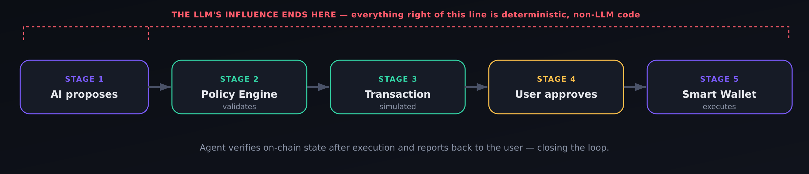
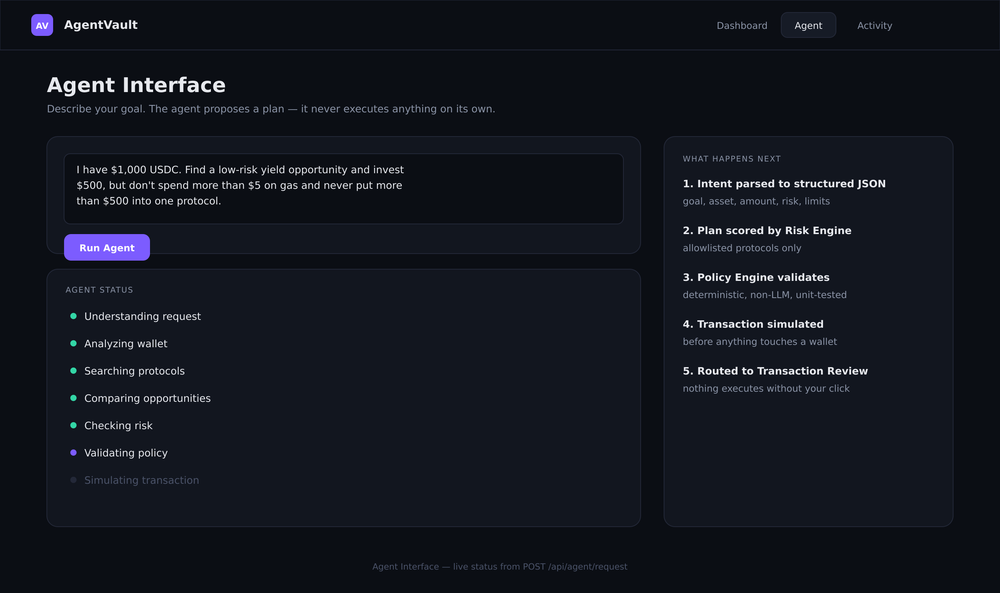
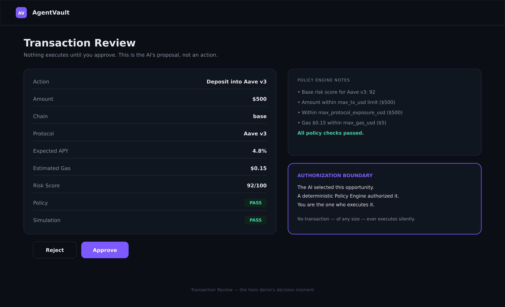
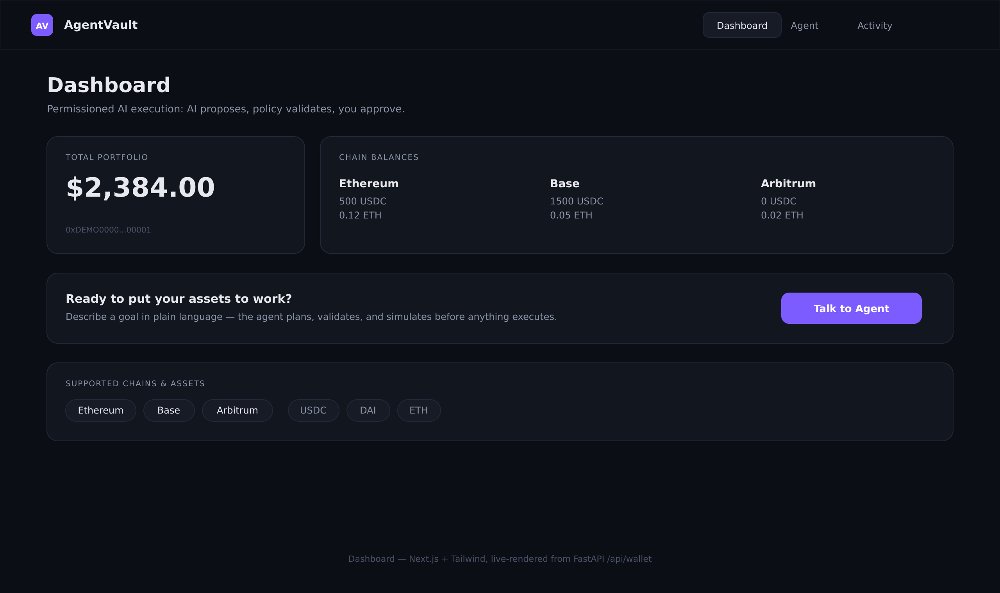
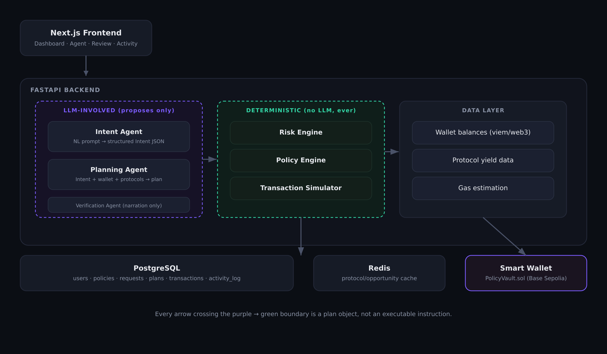

<div align="center">

# AgentVault

**Permissioned AI-agent execution layer for on-chain finance.**

Built for Hacker House Goa 2026 — AI × Crypto × Multichain.

</div>

<br/>

<div align="center">

</div>

<br/>

## Core thesis

AI agents should be able to act on-chain. Users should never have to give one unrestricted control over their assets.

That boundary — the AI can only *propose*; a deterministic, non-LLM **Policy Engine** decides what's *authorized*; the user gives final *approval* — is the entire product. It's a hard architectural separation, not a prompt instruction. See it for yourself in [`backend/app/engines/policy_engine.py`](backend/app/engines/policy_engine.py).

---

## Product tour

**Agent Interface** — describe a goal in plain language. The agent narrates its own progress; it never exposes raw chain-of-thought, and it never touches a wallet.



**Transaction Review** — the decision moment. Every field the Policy Engine checked, and why it passed or failed, laid out before you click anything.



**Dashboard** — portfolio, chain balances, and the entry point into the agent, at a glance.



---

## Architecture



```
agentvault/
├── backend/          FastAPI service: agents, engines, routers, tests
├── frontend/          Next.js + TypeScript + Tailwind UI
├── contracts/          Solidity fallback smart wallet (Hardhat project)
└── docker-compose.yml   Full local stack (Postgres + Redis + backend + frontend)
```

This is a **working, testable, demo-ready build**, not a slide deck. The full pipeline — natural language → intent → plan → risk score → policy check → simulation → approval → execution → verification — runs end-to-end today, backed by 17 passing tests. Two pieces are intentionally mocked so the whole thing runs with zero external dependencies out of the box (see below), and both are designed so swapping in the real integration is a localized change, not a rewrite.

---

## Quickstart

### Backend

```bash
cd backend
python3 -m venv .venv && source .venv/bin/activate
pip install -r requirements.txt
cp .env.example .env   # optional: add ANTHROPIC_API_KEY for LLM-based intent parsing
uvicorn app.main:app --reload
# -> http://localhost:8000  (docs at /docs)
```

Run the test suite:

```bash
python3 -m pytest -v
```

### Frontend

```bash
cd frontend
npm install
cp .env.local.example .env.local
npm run dev
# -> http://localhost:3000
```

### Everything via Docker

```bash
docker compose up --build
```

(Docker Compose targets Postgres for a production-shaped setup; the backend defaults to SQLite for zero-setup local dev — just change `DATABASE_URL`.)

### Smart contract (fallback PolicyVault)

```bash
cd contracts
npm install
npx hardhat test
# deploy: cp .env.example .env, fill in RPC/keys, then:
npm run deploy:base-sepolia
```

---

## The hero demo, end to end

1. Open the **Agent** page, submit:
   > "I have $1,000 USDC. Find a low-risk yield opportunity and invest $500, but don't spend more than $5 on gas and never put more than $500 into one protocol."
2. Watch the step tracker: Understanding request → Analyzing wallet → Searching protocols → Comparing opportunities → Checking risk → Validating policy → Simulating transaction.
3. You're routed to **Transaction Review**: protocol, chain, amount, expected APY, gas, risk score, policy PASS/FAIL, simulation PASS/FAIL.
4. Click **Approve** (or **Reject** — nothing happens without your click).
5. Executed transaction hash + confirmation shown; entry appears in **Activity**.

---

## What's mocked, and why

| Component | Mocked in this build | Real version | Effort to swap |
|---|---|---|---|
| Wallet balances | Hardcoded per-chain balances (`services/wallet_service.py`) | `viem`/`web3.py` RPC reads | Low — same function signature |
| Protocol yield data | Small hand-vetted allowlist (`services/protocol_data.py`) | Live protocol APIs / DefiLlama, still filtered through the same allowlist | Low–Medium |
| Transaction simulation | Deterministic mock (`engines/simulator.py`) | Tenderly simulation API or local Anvil fork `eth_call` | Low — same interface |
| Smart wallet execution | Mock relayer call (`smart_wallet/mock_wallet.py`) | `PolicyVault.sol` (included, tested) via a real relayer, or a Safe module | Medium |

None of these mocks touch the security model — Policy Engine, Risk Engine, and the approval gate are fully real, deterministic, and unit-tested today.

---

## Security model

See [`backend/app/engines/policy_engine.py`](backend/app/engines/policy_engine.py).

- The LLM (Intent Agent, Planning Agent) never executes anything and never sees a private key.
- Every proposed plan passes through the Policy Engine — a small, dependency-free, 100%-deterministic module — before it can be simulated or approved.
- Every transaction, regardless of size, requires an explicit user `approve` call. There is no silent-execution path.
- The Risk Engine only scores protocols on a hand-vetted allowlist; anything else scores 0 and is rejected downstream.
- The fallback `PolicyVault.sol` contract adds a second, on-chain enforcement point: even a compromised backend relayer key can only move funds to contracts explicitly allowlisted by the (separate) owner key.

## Multichain scope

Ethereum, Base, and Arbitrum balances are readable; the live opportunity-discovery + execution demo path is **Base-first** for reliability (cheap, fast finality). This was a deliberate scope cut — see the architecture discussion for the full reasoning.

## What NOT to build (scope guardrails)

Not a chatbot, not a trading bot, not an NFT marketplace, not a 20-chain wallet, not an unrestricted autonomous agent. Every addition should be checked against: *does this materially improve the core AgentVault experience or Hacker House Goa selection potential?* If not, cut it.
